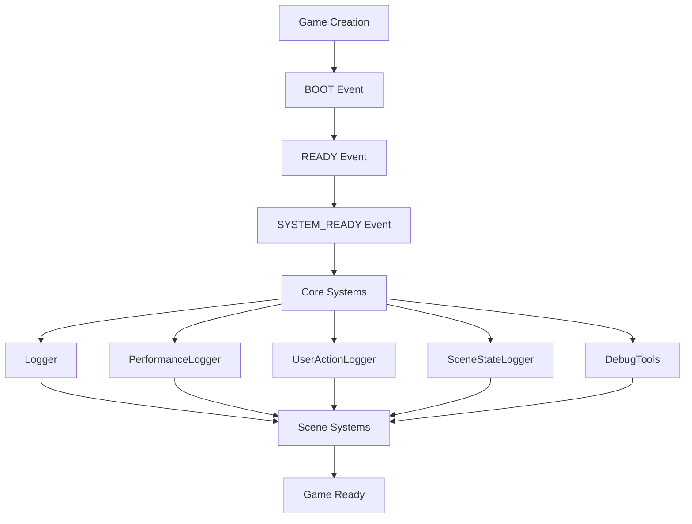

# Timing System Architecture

## Overview

This document outlines the architectural decisions and implementation patterns for building a robust, graceful, and extensible timing system for the Goal Bingo game. The system addresses the critical timing issues encountered during development and provides a foundation for future system initialization.

**Related Documentation**:
- [Phaser Core Events](https://newdocs.phaser.io/docs/3.85.1/Phaser.Core.Events) - Official Phaser event documentation
- [Phaser Game Lifecycle](https://newdocs.phaser.io/docs/3.85.1/Phaser.Core.Game) - Game initialization lifecycle
- [Phaser Patterns](phaser-patterns.md) - Project-specific Phaser patterns
- [Phaser Facts](phaser-facts.md) - Common misconceptions and corrections

## Problem Statement

### **Root Cause Analysis**

The Goal Bingo project encountered significant timing issues during system initialization:

1. **Race Conditions**: Systems trying to access Phaser subsystems before they were ready
2. **Event Timing Misunderstanding**: Incorrect assumptions about when Phaser events fire
3. **Dependency Management**: Lack of proper dependency ordering for system initialization
4. **Error Recovery**: No graceful handling of initialization failures

### **Critical Issues Identified**

1. **Scene Manager Unavailable**: `game.scene` not available immediately after `Phaser.Core.Events.READY`
2. **Event System Timing**: `game.events` not available immediately after game creation
3. **System Dependencies**: Complex interdependencies between logging, performance, and scene systems
4. **Initialization Order**: No clear pattern for initializing systems in the correct sequence

## Architectural Solution

### **Core Principles**

1. **Event-Driven Initialization**: Use Phaser's event system for proper timing
   - **Pattern**: [Event-Driven Initialization Pattern](phaser-patterns.md#event-driven-initialization-pattern)
   - **Reference**: [Phaser Core Events](https://newdocs.phaser.io/docs/3.85.1/Phaser.Core.Events)
2. **Dependency Management**: Clear dependency graphs and initialization order
   - **Pattern**: [Dependency Management Pattern](phaser-patterns.md#dependency-management-pattern)
   - **Reference**: [Phaser System Dependencies](https://newdocs.phaser.io/docs/3.85.1/Phaser.Core.Game)
3. **Graceful Degradation**: Systems should work even if dependencies fail
   - **Pattern**: [Graceful Degradation Pattern](phaser-patterns.md#graceful-degradation-pattern)
   - **Reference**: [Phaser Error Handling](https://newdocs.phaser.io/docs/3.85.1/Phaser.Events.EventEmitter)
4. **Extensibility**: Easy to add new systems without breaking existing ones
   - **Pattern**: [Service Locator Pattern](phaser-patterns.md#service-locator-pattern)
   - **Reference**: [Phaser Plugin System](https://newdocs.phaser.io/docs/3.85.1/Phaser.Plugins)
5. **Testability**: Systems should be easily testable in isolation
   - **Pattern**: [Testing Patterns](phaser-patterns.md#testing-patterns)
   - **Reference**: [Phaser Testing](https://newdocs.phaser.io/docs/3.85.1/Phaser.Core.Game)

### **System Architecture**



### **Initialization Sequence**

#### **Phase 1: Core System Initialization**
```javascript
// Wait for Phaser to be ready
game.events.once(Phaser.Core.Events.READY, async () => {
    // Initialize core systems that only need game.events
    await initializeCoreSystems();
});
```

#### **Phase 2: Scene Manager Systems**
```javascript
// Wait for Scene Manager to be ready
game.events.once(Phaser.Core.Events.SYSTEM_READY, async () => {
    // Initialize systems that need game.scene
    await initializeSceneSystems();
});
```

#### **Phase 3: Scene-Specific Systems**
```javascript
// Initialize within each scene's create() method
class MainMenuScene extends Phaser.Scene {
    create() {
        // Initialize scene-specific systems
        await initializeSceneSpecificSystems();
    }
}
```

## Implementation Patterns

### **1. Lazy Initialization Pattern**

**Pattern Reference**: [System Initialization Pattern](phaser-patterns.md#system-initialization-pattern)
**Official Documentation**: [Phaser Game Events](https://newdocs.phaser.io/docs/3.85.1/Phaser.Core.Events)

```javascript
class SystemManager {
    constructor(game) {
        this.game = game;
        this.systems = new Map();
        this.initializationQueue = [];
        this.isInitialized = false;
    }
    
    async initialize() {
        if (this.isInitialized) return;
        
        // Wait for required systems
        await this.waitForDependencies();
        
        // Initialize systems in order
        for (const systemName of this.initializationOrder) {
            await this.initializeSystem(systemName);
        }
        
        this.isInitialized = true;
    }
    
    async waitForDependencies() {
        const dependencies = ['events', 'scene'];
        await Promise.all(dependencies.map(dep => this.waitForSystem(dep)));
    }
    
    async waitForSystem(systemName) {
        return new Promise((resolve) => {
            const checkSystem = () => {
                if (this.game[systemName]) {
                    resolve();
                } else {
                    setTimeout(checkSystem, 10);
                }
            };
            checkSystem();
        });
    }
}
```

### **2. Service Locator Pattern**

**Pattern Reference**: [Service Locator Pattern](phaser-patterns.md#service-locator-pattern)
**Official Documentation**: [Phaser Plugin System](https://newdocs.phaser.io/docs/3.85.1/Phaser.Plugins)

```javascript
class ServiceLocator {
    constructor() {
        this.services = new Map();
        this.pendingRequests = new Map();
        this.initializationPromises = new Map();
    }
    
    async register(name, serviceFactory) {
        if (this.services.has(name)) {
            return this.services.get(name);
        }
        
        // Initialize service
        const service = await serviceFactory();
        this.services.set(name, service);
        
        // Resolve pending requests
        if (this.pendingRequests.has(name)) {
            const requests = this.pendingRequests.get(name);
            requests.forEach(resolve => resolve(service));
            this.pendingRequests.delete(name);
        }
        
        return service;
    }
    
    async get(name) {
        if (this.services.has(name)) {
            return this.services.get(name);
        }
        
        // Wait for service to be registered
        return new Promise((resolve) => {
            if (!this.pendingRequests.has(name)) {
                this.pendingRequests.set(name, []);
            }
            this.pendingRequests.get(name).push(resolve);
        });
    }
}
```

### **3. Event-Driven Initialization Pattern**

**Pattern Reference**: [Event-Driven Initialization Pattern](phaser-patterns.md#event-driven-initialization-pattern)
**Official Documentation**: [Phaser Core Events](https://newdocs.phaser.io/docs/3.85.1/Phaser.Core.Events)

```javascript
class EventDrivenSystem {
    constructor(game, dependencies = []) {
        this.game = game;
        this.dependencies = dependencies;
        this.isReady = false;
        this.initializationPromise = null;
    }
    
    async initialize() {
        if (this.initializationPromise) {
            return this.initializationPromise;
        }
        
        this.initializationPromise = this.performInitialization();
        return this.initializationPromise;
    }
    
    async performInitialization() {
        // Wait for dependencies
        await this.waitForDependencies();
        
        // Set up event listeners
        this.setupEventListeners();
        
        // Mark as ready
        this.isReady = true;
    }
    
    async waitForDependencies() {
        for (const dep of this.dependencies) {
            await this.waitForDependency(dep);
        }
    }
    
    async waitForDependency(dependency) {
        return new Promise((resolve) => {
            if (this.game[dependency]) {
                resolve();
            } else {
                this.game.events.once(Phaser.Core.Events.READY, () => {
                    if (this.game[dependency]) {
                        resolve();
                    } else {
                        // Wait for SYSTEM_READY for scene manager
                        this.game.events.once(Phaser.Core.Events.SYSTEM_READY, resolve);
                    }
                });
            }
        });
    }
}
```

### **4. Graceful Degradation Pattern**

**Pattern Reference**: [Graceful Degradation Pattern](phaser-patterns.md#graceful-degradation-pattern)
**Official Documentation**: [Phaser Error Handling](https://newdocs.phaser.io/docs/3.85.1/Phaser.Events.EventEmitter)

```javascript
class RobustSystem {
    constructor(game, options = {}) {
        this.game = game;
        this.maxRetries = options.maxRetries || 3;
        this.retryDelay = options.retryDelay || 100;
        this.fallbackMode = false;
    }
    
    async initialize() {
        for (let attempt = 1; attempt <= this.maxRetries; attempt++) {
            try {
                await this.attemptInitialization();
                return;
            } catch (error) {
                console.warn(`Initialization attempt ${attempt} failed:`, error);
                
                if (attempt === this.maxRetries) {
                    console.error('System initialization failed after all retries');
                    this.enableFallbackMode();
                } else {
                    await this.delay(this.retryDelay * attempt);
                }
            }
        }
    }
    
    enableFallbackMode() {
        this.fallbackMode = true;
        console.log('System running in fallback mode');
        // Provide basic functionality without full system
    }
    
    delay(ms) {
        return new Promise(resolve => setTimeout(resolve, ms));
    }
}
```

## System Dependencies

### **Dependency Graph**

```javascript
const SYSTEM_DEPENDENCIES = {
    'Logger': {
        dependencies: ['game.events'],
        initializationOrder: 1,
        critical: true
    },
    'PerformanceLogger': {
        dependencies: ['Logger', 'game.events'],
        initializationOrder: 2,
        critical: false
    },
    'UserActionLogger': {
        dependencies: ['Logger', 'game.scene'],
        initializationOrder: 3,
        critical: false
    },
    'SceneStateLogger': {
        dependencies: ['Logger', 'game.scene'],
        initializationOrder: 4,
        critical: false
    },
    'DebugTools': {
        dependencies: ['game.scene', 'game.events'],
        initializationOrder: 5,
        critical: false
    }
};
```

### **Initialization Order Management**

```javascript
class InitializationManager {
    constructor(game) {
        this.game = game;
        this.systems = new Map();
        this.initializationOrder = this.calculateInitializationOrder();
    }
    
    calculateInitializationOrder() {
        const order = [];
        const visited = new Set();
        const visiting = new Set();
        
        const visit = (systemName) => {
            if (visiting.has(systemName)) {
                throw new Error(`Circular dependency detected: ${systemName}`);
            }
            if (visited.has(systemName)) {
                return;
            }
            
            visiting.add(systemName);
            const system = SYSTEM_DEPENDENCIES[systemName];
            if (system) {
                for (const dep of system.dependencies) {
                    if (dep.startsWith('game.')) {
                        continue; // Skip game dependencies
                    }
                    visit(dep);
                }
            }
            visiting.delete(systemName);
            visited.add(systemName);
            order.push(systemName);
        };
        
        for (const systemName of Object.keys(SYSTEM_DEPENDENCIES)) {
            visit(systemName);
        }
        
        return order;
    }
    
    async initializeAll() {
        // Wait for core systems
        await this.waitForCoreSystems();
        
        // Initialize systems in dependency order
        for (const systemName of this.initializationOrder) {
            await this.initializeSystem(systemName);
        }
    }
    
    async waitForCoreSystems() {
        return new Promise((resolve) => {
            const checkSystems = () => {
                if (this.game.events && this.game.scene) {
                    resolve();
                } else {
                    setTimeout(checkSystems, 10);
                }
            };
            checkSystems();
        });
    }
}
```

## Error Handling and Recovery

### **Error Types**

1. **Initialization Errors**: Systems fail to initialize
2. **Dependency Errors**: Required dependencies not available
3. **Timing Errors**: Systems accessed before ready
4. **Runtime Errors**: Systems fail during operation

### **Recovery Strategies**

1. **Retry with Backoff**: Retry failed initializations with exponential backoff
2. **Fallback Mode**: Provide basic functionality when full system fails
3. **Graceful Degradation**: Disable non-critical features when dependencies fail
4. **Circuit Breaker**: Prevent cascading failures by temporarily disabling failing systems

### **Error Recovery Implementation**

```javascript
class ErrorRecoveryManager {
    constructor() {
        this.failedSystems = new Set();
        this.retryAttempts = new Map();
        this.circuitBreakerThreshold = 3;
    }
    
    async handleInitializationError(systemName, error) {
        console.error(`Initialization error for ${systemName}:`, error);
        
        const attempts = this.retryAttempts.get(systemName) || 0;
        if (attempts < this.circuitBreakerThreshold) {
            // Retry with exponential backoff
            const delay = Math.pow(2, attempts) * 1000;
            await this.delay(delay);
            
            this.retryAttempts.set(systemName, attempts + 1);
            return this.retryInitialization(systemName);
        } else {
            // Enable fallback mode
            this.failedSystems.add(systemName);
            return this.enableFallbackMode(systemName);
        }
    }
    
    async retryInitialization(systemName) {
        try {
            return await this.initializeSystem(systemName);
        } catch (error) {
            return this.handleInitializationError(systemName, error);
        }
    }
    
    enableFallbackMode(systemName) {
        console.log(`Enabling fallback mode for ${systemName}`);
        // Implement fallback functionality
    }
}
```

## Testing Strategy

### **Unit Testing**

```javascript
describe('Timing System', () => {
    let game;
    let systemManager;
    
    beforeEach(async () => {
        game = new Phaser.Game(mockConfig);
        systemManager = new SystemManager(game);
    });
    
    afterEach(() => {
        game.destroy();
    });
    
    it('should initialize systems in correct order', async () => {
        await systemManager.initialize();
        
        expect(systemManager.isInitialized).toBe(true);
        expect(systemManager.systems.size).toBeGreaterThan(0);
    });
    
    it('should handle initialization failures gracefully', async () => {
        // Mock system failure
        jest.spyOn(systemManager, 'initializeSystem').mockRejectedValue(new Error('Test error'));
        
        await systemManager.initialize();
        
        expect(systemManager.fallbackMode).toBe(true);
    });
    
    it('should wait for dependencies before initializing', async () => {
        const initSpy = jest.spyOn(systemManager, 'initializeSystem');
        
        await systemManager.initialize();
        
        // Verify systems were initialized in dependency order
        expect(initSpy).toHaveBeenCalledWith('Logger');
        expect(initSpy).toHaveBeenCalledWith('PerformanceLogger');
    });
});
```

### **Integration Testing**

```javascript
describe('System Integration', () => {
    it('should initialize all systems without errors', async () => {
        const game = new Phaser.Game(config);
        const systemManager = new SystemManager(game);
        
        await systemManager.initialize();
        
        // Verify all systems are working
        expect(systemManager.getSystem('Logger')).toBeDefined();
        expect(systemManager.getSystem('PerformanceLogger')).toBeDefined();
        expect(systemManager.getSystem('UserActionLogger')).toBeDefined();
    });
    
    it('should handle scene transitions correctly', async () => {
        const game = new Phaser.Game(config);
        const systemManager = new SystemManager(game);
        
        await systemManager.initialize();
        
        // Test scene transition
        game.scene.start('MainMenuScene');
        
        // Verify systems are still working
        expect(systemManager.getSystem('SceneStateLogger')).toBeDefined();
    });
});
```

## Performance Considerations

### **Initialization Performance**

1. **Lazy Loading**: Initialize systems only when needed
2. **Parallel Initialization**: Initialize independent systems simultaneously
3. **Caching**: Cache initialized systems to avoid re-initialization
4. **Memory Management**: Clean up unused systems to prevent memory leaks

### **Runtime Performance**

1. **Event Throttling**: Throttle high-frequency events to prevent performance issues
2. **Resource Pooling**: Use object pooling for frequently created/destroyed objects
3. **Memory Monitoring**: Monitor memory usage and clean up when necessary
4. **Performance Metrics**: Track system performance and optimize bottlenecks

### **Performance Monitoring**

```javascript
class PerformanceMonitor {
    constructor() {
        this.metrics = new Map();
        this.thresholds = {
            initializationTime: 1000, // 1 second
            memoryUsage: 100 * 1024 * 1024, // 100MB
            fps: 30
        };
    }
    
    startTiming(systemName) {
        this.metrics.set(systemName, {
            startTime: performance.now(),
            endTime: null,
            duration: null
        });
    }
    
    endTiming(systemName) {
        const metric = this.metrics.get(systemName);
        if (metric) {
            metric.endTime = performance.now();
            metric.duration = metric.endTime - metric.startTime;
            
            if (metric.duration > this.thresholds.initializationTime) {
                console.warn(`Slow initialization for ${systemName}: ${metric.duration}ms`);
            }
        }
    }
    
    checkMemoryUsage() {
        if (performance.memory) {
            const used = performance.memory.usedJSHeapSize;
            if (used > this.thresholds.memoryUsage) {
                console.warn(`High memory usage: ${used / 1024 / 1024}MB`);
            }
        }
    }
}
```

## Extensibility

### **Adding New Systems**

1. **Define Dependencies**: Add system to `SYSTEM_DEPENDENCIES`
2. **Implement Interface**: Create system class with `initialize()` method
3. **Register System**: Add to system manager
4. **Test Integration**: Ensure system works with existing systems

### **System Interface**

```javascript
class SystemInterface {
    constructor(game, dependencies = []) {
        this.game = game;
        this.dependencies = dependencies;
        this.isReady = false;
    }
    
    async initialize() {
        throw new Error('initialize() must be implemented');
    }
    
    async shutdown() {
        throw new Error('shutdown() must be implemented');
    }
    
    getStatus() {
        return {
            isReady: this.isReady,
            dependencies: this.dependencies
        };
    }
}
```

### **Plugin System**

```javascript
class PluginManager {
    constructor() {
        this.plugins = new Map();
        this.hooks = new Map();
    }
    
    register(name, plugin) {
        this.plugins.set(name, plugin);
        
        // Set up hooks
        if (plugin.hooks) {
            for (const [hook, callback] of Object.entries(plugin.hooks)) {
                if (!this.hooks.has(hook)) {
                    this.hooks.set(hook, []);
                }
                this.hooks.get(hook).push(callback);
            }
        }
    }
    
    async executeHook(hook, ...args) {
        const callbacks = this.hooks.get(hook) || [];
        for (const callback of callbacks) {
            await callback(...args);
        }
    }
}
```

## Migration Strategy

### **Phase 1: Core System Refactoring**

1. **Update Logger**: Implement lazy initialization pattern
2. **Update PerformanceLogger**: Add proper dependency management
3. **Update UserActionLogger**: Add scene manager dependency handling
4. **Update SceneStateLogger**: Add proper initialization timing
5. **Update DebugTools**: Add system dependency management

### **Phase 2: System Manager Implementation**

1. **Create SystemManager**: Implement dependency management
2. **Create ServiceLocator**: Implement service registration and retrieval
3. **Create ErrorRecoveryManager**: Implement error handling and recovery
4. **Create PerformanceMonitor**: Implement performance monitoring

### **Phase 3: Testing and Validation**

1. **Unit Tests**: Test individual systems in isolation
2. **Integration Tests**: Test system interactions
3. **Performance Tests**: Validate performance improvements
4. **Error Tests**: Test error handling and recovery

### **Phase 4: Documentation and Training**

1. **Update Documentation**: Document new patterns and practices
2. **Create Examples**: Provide examples for common use cases
3. **Team Training**: Train team on new patterns and practices
4. **Code Review**: Establish code review guidelines

## Conclusion

The timing system architecture provides a robust, graceful, and extensible foundation for system initialization in the Goal Bingo game. By following the patterns and practices outlined in this document, the project can avoid timing issues and build maintainable, testable systems.

### **Key Benefits**

1. **Reliability**: Systems initialize in the correct order with proper error handling
2. **Maintainability**: Clear patterns and practices make the code easy to understand and modify
3. **Extensibility**: Easy to add new systems without breaking existing ones
4. **Testability**: Systems can be tested in isolation and integration
5. **Performance**: Optimized initialization and runtime performance

### **Next Steps**

1. **Implement Core Patterns**: Start with the basic patterns and gradually add complexity
2. **Test Thoroughly**: Ensure all systems work correctly with the new architecture
3. **Monitor Performance**: Track performance improvements and optimize as needed
4. **Document Changes**: Keep documentation up to date as the system evolves
5. **Train Team**: Ensure all team members understand the new patterns and practices

---

*This document should be updated as the timing system evolves and new patterns are discovered.*
